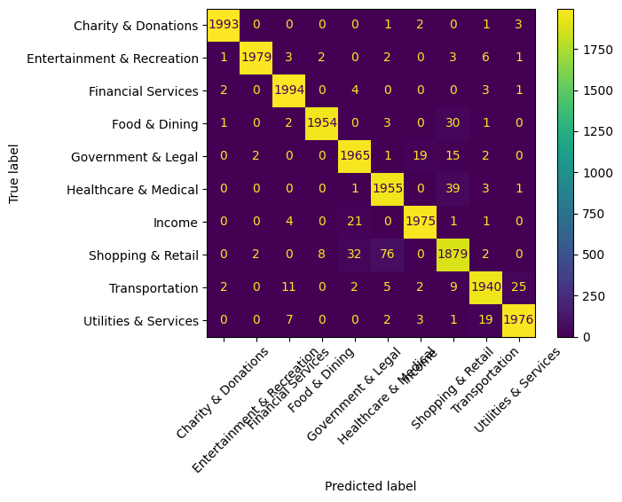

# Spending Categorizer 

Automatically categorize your financial transactions using NLP, and visualize your spending trends in a clean, interactive Streamlit dashboard.

Upload your credit card statement and check out the app yourself!

[Click here (˶ᵔ ᵕ ᵔ˶)](https://spendingtracker.streamlit.app/)

## Project Overview

This project helps users upload their transaction data and receive:
- Automated transaction categorization using BERT sentence embeddings and Logistic Regression.
- Visual dashboards summarizing monthly spending, top categories, and detailed breakdowns.
- A live Streamlit app that works directly with user-uploaded files (CSV, Excel, Parquet).


## Tech Stack

- **Python**: Pandas, Scikit-learn, BERT sentence-transformers, Plotly
- **Streamlit**: Interactive dashboard for visualization & trend exploration
- **Jupyter Notebook**: Data preprocessing & model training


## Dataset

**Source**: [Transaction Categorization](https://huggingface.co/datasets/mitulshah/transaction-categorization)  
**Size**: 4,501,043 transactions  
**Selected Feature**: Transaction description  
**Target**: Category (10 categories including Food & Dining, Transportation, Shopping & Retail, Income, etc.)


## Workflow

### 1. Data Preprocessing (`preprocessing.ipynb`)
- Removed null entries and special characters
- Converted text to lowercase and normalized whitespace
- Created clean description column for model input

### 2. Model Training (`classifier.ipynb`)

**BERT Embeddings + Logistic Regression** 

- Uses SentenceTransformer (`all-MiniLM-L6-v2`) to convert descriptions into contextual sentence embeddings
- Trained on 80,000 samples (balanced across 10 categories)
- Tested on 20,000 samples

**Performance Metrics:**
- **Accuracy: 98.05%**
- **Weighted Avg F1-Score: 0.98**

**Why BERT?**
- Handles semantic similarity effectively (e.g., "Starbucks Coffee" and "STARBUCKS #123")
- Generalizes better to real-world transaction data with inconsistent formatting
- Significantly outperforms TF-IDF in precision, recall, and F1-score

**Confusion Matrix:**



### 3. Streamlit Dashboard (`app.py`)

Built an interactive app for users to upload their own files and:
- Auto-categorize transactions using the BERT model
- View spending insights via:
  - Monthly spending trend (line chart)
  - Top 5 spending categories (bar chart)
  - Top spending months
  - Raw categorized transaction table
  - Download categorized data as CSV

**Features:**
- Smart column detection (auto-suggests description, date, amount columns)
- Supports multiple file formats (CSV, Excel, Parquet)
- Beautiful gradient UI with interactive Plotly charts
- Real-time processing with progress indicators


## Getting Started

### Installation

```bash
# Clone repository
git clone <repository-url>
cd spending_tracker

# Install dependencies
pip install -r requirements.txt

# Run Streamlit app
streamlit run app.py
```

## Contact ⋆˙⟡

🔗 [LinkedIn](https://www.linkedin.com/in/vidhi-parmar1/) | [Email](vidhi30th@gmail.com) | [Website](https://readymag.website/5667522/)
